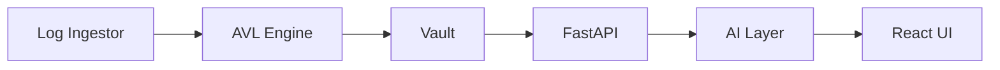

# Sentinel-Vault

Sentinel-Vault is a C++ SIEM prototype with scored blacklist detection, RAID 1 vault storage, a FastAPI layer, AI analysis, and a React dashboard.



## Setup

```bash
docker-compose up
```

The dashboard is available at `http://localhost:3000` and the API at `http://localhost:8000`.

## Endpoint reference

| Endpoint | Description |
| --- | --- |
| `GET /events?page=1&page_size=50` | Paginated vault events with status and threat score. |
| `GET /threats` | Blacklisted IPs and their scores. |
| `GET /stats` | Event totals, detected threats, mirror count, and last sync time. |
| `POST /analyze` | IsolationForest analysis for `ip_freq`, `hour`, and `event_type_encoded`. |
